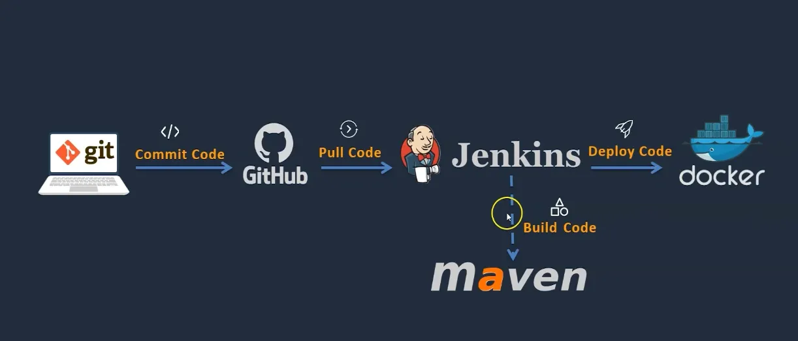

In this project, we are going to deploy a Java Web app on a Docker Container built on an EC2 Instance through the use of Jenkins.

# Plan
- Setup Jenkins
- Setup & Configure Maven, Git and docker
- Setup the deploy machine
- Write Dockerfile
- Setup docker image repository
- Automate the Build and Deploy process using Jenkins
- Test the deployment

# Prerequisites
- AWS Account
- Github Account with the Source Code
- A local machine with CLI Access